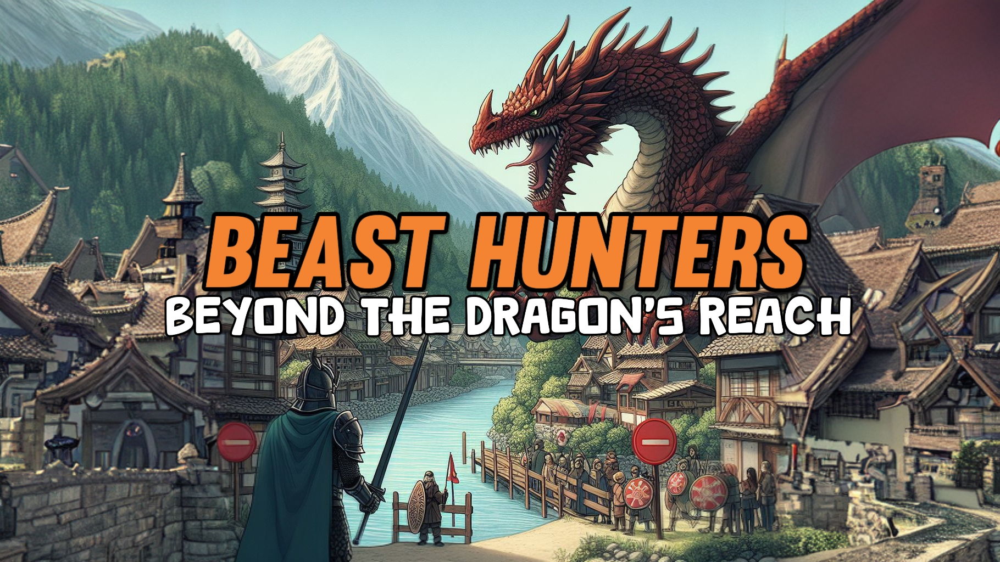

# Beast Hunters



## Overview

**Beast Hunters** is an exciting **role-playing game (RPG)** that takes players on an epic adventure filled with mystical creatures and heroic battles. 💥 Face off against slimes, fanged beasts, and a ferocious dragon 🐲 to save a town under siege! 

[](https://codexjatin.github.io/BEAST-HUNTERS/)


## 🌟 Features

- **Diverse Enemies:** 🐾 Encounter slimes, fanged beasts, and the ultimate dragon boss in thrilling battles.  
- **Hero Customization:** 🛡️ Arm your hero with weapons and items purchased from the in-game store to gain a strategic edge.  
- **Realistic Store Interaction:** 💰 Visit **Thornhaven Outfitters** to heal your wounds and buy weapons using gold. Make tactical decisions to ensure survival!  
- **Dynamic Battles:** ⚔️ Engage in fast-paced, visually immersive battles against mythical creatures.  


## 👀 Preview

### 🏰 Title Screen


### 🌄 Game Intro


### ⚒️ Buying a Weapon


## Contribution Instructions:
If you'd like to contribute to this project, please refer to the CONTRIBUTING.md file for the appropriate contribution instructions. It contains guidelines on how to submit issues, pull requests, and follow the code of conduct for this project.


## 🛠️ How to Contribute

We’d love to have you join the **Beast Hunters** community! 🌟 Follow these steps to contribute:  

1. **Fork the Repository**  
   Head over to the [GitHub Repository](https://github.com/CODExJATIN/BEAST-HUNTERS) and fork it.  

   ```bash
   # Clone the forked repository to your local machine
   git clone https://github.com/CODExJATIN/BEAST-HUNTERS.git
   cd BEAST-HUNTERS
   ```

2. **Create a Feature Branch**  
   Work on a separate branch for your feature or bug fix:  

   ```bash
   # Create and switch to a new branch
   git checkout -b feature/your-feature-name
   ```

3. **Make Your Changes**  
   Add your new features, fix bugs, or improve the game in any way you can.  

   ```bash
   # Stage and commit your changes
   git add .
   git commit -m "Add: Description of your changes"
   ```

4. **Push Your Changes**  
   Push your feature branch to your forked repository:  

   ```bash
   git push origin feature/your-feature-name
   ```

5. **Submit a Pull Request**  
   Go to the original repository and submit a Pull Request (PR) from your feature branch.  
   Mention the changes you’ve made and why they are beneficial.

6. **Report Issues**  
   Found a bug? Let us know by [opening an issue](https://github.com/CODExJATIN/BEAST-HUNTERS/issues):  

   ```bash
   # Check for issues in the repository
   git fetch origin
   ```

7. **Share Feedback**  
   Share your thoughts and ideas to make the game even better! 💡  


## 🥷🏻 Our Contributors

<a href="https://github.com/CODExJATIN/BEAST-HUNTERS/graphs/contributors">


---

## 🎉 Credits

**Beast Hunters** is developed by **JATIN**. 👨🏻‍💻  

Feel free to contribute, report issues, or share your thoughts. Every bit helps us create an even more amazing game! 🌟  

**Happy hunting, heroes! 🐾⚔️🐉**


